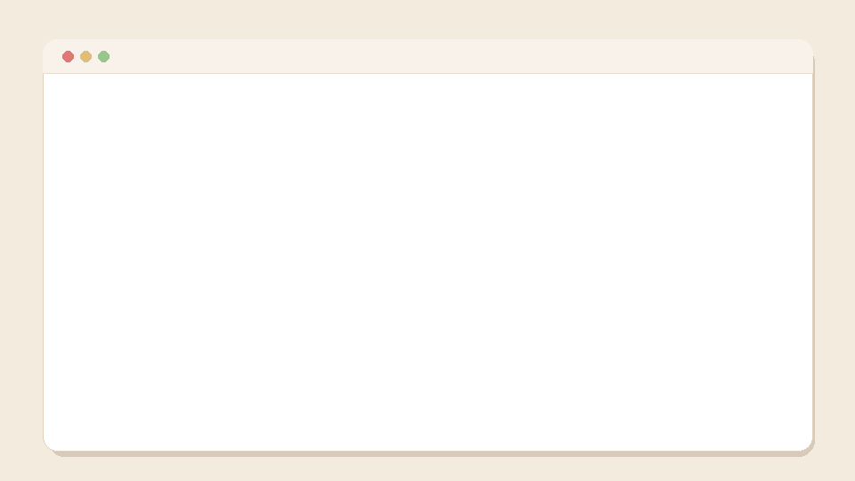
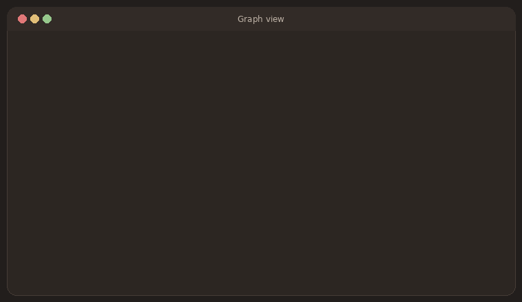
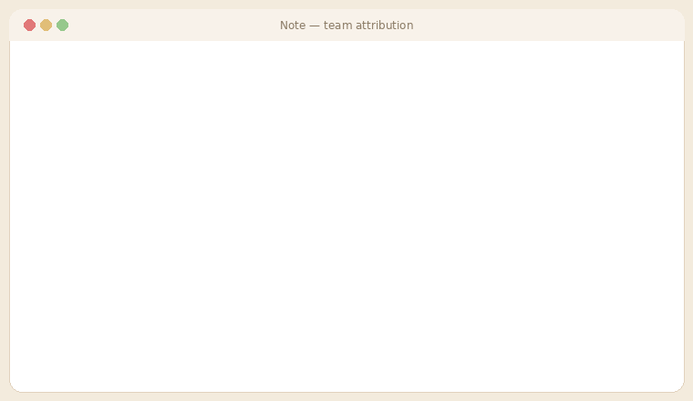

# Personae 

**Personae is an open-source Obsidian vault template for researchers whose work revolves around people, events, places, organisations, concepts and sources**. I designed it for my own work as a historian of social networks, but it will also be useful for genealogists, digital-humanities scholars, ethnographers, and investigative researchers mapping people and networks.

It comes pre-configured with a sample project (the Russian Revolution) so you can see how every part works before replacing it with your own research.

## Key features

### See the whole social network

Every `[[link]]` you write between notes creates a connection. Open Obsidian's graph and an entire web of people, organisations, places and events is mapped out. You can see your research expand in real time.

### Every database, one Home page

A single Project Home gives you navigation cards into self-maintaining databases (People, Concepts, Organisations, Publications and a live bibliography) that build themselves from your notes' frontmatter. Add a person, and they appear in the tables automatically.

### Built for collaboration

Share the vault as a git repository and a whole team can contribute, with full history. The Note Attribution plugin colours every line by who wrote it. Ideal for co-authored research and team projects.

### Citations & bibliography (Zotero)

Cite a `[[citekey]]` anywhere in your prose and Personae renders a clean reference card and assembles a Chicago-style bibliography for you — powered by Zotero.

### Maps and self-building databases

Paste coordinates and places appear as markers on an interactive Leaflet map; add dates and the timelines and by-year lists assemble themselves. The data you enter once drives the maps, charts and chronologies.

> The animations above are illustrative renders of the interface. To showcase the live app, drop a screen recording into `assets/` (see the comment in *Getting started*).

## What you get

- **Structured note templates** for People, Events, Locations, Organisations, Concepts, Publications, Archival Sources, Interviews, Writing Projects, Daily Notes and Research Logs — each with frontmatter fields that drive the databases below.
- **Self-maintaining databases**: People, Concepts and Organisations databases plus a Bibliography that build themselves from your notes' metadata (via Dataview).
- **A landing page** (Project Home) with navigation cards and quick-capture boxes for daily notes and research logs.
- **Visual tools**: a geographic Network Map (Leaflet), a Network Diagram (Canvas), a chronological Master Timeline, and a **family tree** on every Person note (parents / spouse / children) with a right-click *Add as relative* command.
- **Interview / fieldwork notes** for oral history and qualitative research — informant, setting, consent, themes and timestamped excerpts.
- **Zotero integration** for citations and an auto-building Chicago-style bibliography.
- **Readability styling**: serif pull-quote blockquotes; colour-coded source callouts (memoir / source / archive / report / translation) plus a lightbulb *idea* callout; a clean Zotero citation card; image captions; monograph-style tables and footnotes; and a responsive layout for phones and narrow panes.
- **Two custom plugins**:
  - *Caption on Paste* — prompts you for a caption whenever you paste an image.
  - *Note Attribution* — shows who wrote each line of every note (via git), with per-author colours and contributor summaries. Built for team research.
- **Collaboration-ready**: designed to be shared as a git repository so a whole team can contribute, with full history and per-line attribution.

## Getting started

Up and running in about two minutes — no sign-up, no paid software:

1. **Download** this repository (green *Code → Download ZIP*, then unzip) or `git clone` it.
2. **Install [Obsidian](https://obsidian.md)** — free, including for commercial use — and choose *Open folder as vault*, pointing at the unzipped folder.
3. When prompted, **trust the author and enable community plugins** — the databases, maps and templates depend on them. (One click; the plugins are bundled, so there's nothing else to install.)
4. Open **`Start Here`** — a five-minute guided tour with checkboxes.
5. `Vault Settings/Health Check` verifies everything is enabled; `Vault Settings/Vault Guide` documents every workflow, beginner-friendly.

> **Why two steps?** Obsidian is the free host app that runs Personae; it can't be bundled into a single download (its licence doesn't allow redistribution), but installing it is a one-time, well-known install. In exchange you get its 2,000-plugin ecosystem, which is what makes the infoboxes, maps and timelines possible.

## What's a plugin doing in my vault?

The vault ships with community plugins pre-configured. Five are essential; the rest are quality-of-life and safe to disable.

| Plugin | Role | Essential? |
|---|---|---|
| Dataview | Every database, dashboard, infobox, and the timeline | **Yes** |
| Templater | Note templates and creation prompts | **Yes** |
| Leaflet | The maps | **Yes** |
| Meta Bind | Quick-create buttons | **Yes** |
| Git | Backup, team sync, attribution history | **Yes** (for teams/backup) |
| Caption on Paste¹ | Asks for a caption when you paste an image | No |
| Note Attribution¹ | Per-line authorship colours (needs git) | No |
| Research Tools¹ | Right-click a selection to extract it into a callout, create a timeline event, or log a research lead; paste map coordinates; footnote & citation helpers | No |
| Zotero Desktop Connector | Citations and the auto-bibliography | No (without Zotero) |

¹ Custom plugins built for this vault — source is plain readable JavaScript in `.obsidian/plugins/`.

## Updating

All shared logic lives in `Vault Settings/scripts/` (one small JavaScript file per feature). To update an existing vault, replace that folder, `.obsidian/snippets/readability.css`, and the three custom plugin folders — your notes are never touched. See `CHANGELOG.md`.

### For teams

See the *Git, Backup & Collaboration* section of the Vault Guide: create a private GitHub repository, invite collaborators, and let the Git plugin auto-sync. The Note Attribution plugin then shows who contributed what, line by line.

## Replacing the sample project

The sample notes (Lenin, Bolsheviks, Petrograd, etc.) are skeletons showing the structure. Delete them and create your own: just make a new note inside any project folder — `People/`, `Events/`, `Locations/`, etc. — and the right template applies itself, prompts included. Or use the quick-create buttons on Project Home. (Keep the folder names; your project's identity lives in your notes — see *Making it yours* in `Start Here`.)

## Requirements

- Obsidian 1.0+
- For Zotero features: [Zotero](https://www.zotero.org) with Better BibTeX
- For collaboration/attribution: [git](https://git-scm.com)

## License

The template's own code — note templates, `Vault Settings/scripts/`, CSS snippets, and the three custom plugins (Research Tools, Note Attribution, Caption on Paste) — is MIT; see `LICENSE`. Use, adapt and share freely.

The bundled community plugins remain under their own licenses (Dataview, Obsidian Git and Leaflet are MIT; **Templater, Meta Bind and Zotero Integration are GPL/AGPL** copyleft). Bundling them here is *mere aggregation* and does not affect the template's MIT license. Per-plugin credits, licenses and source links are in `THIRD-PARTY-LICENSES.md`.
